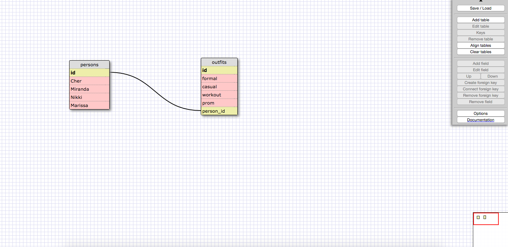

## Challenges

1. SELECT * FROM states;

2. SELECT * FROM regions;

3. SELECT state_name, population FROM states;

4. SELECT state_name, population FROM states ORDER BY population DESC;

5. SELECT state_name FROM states WHERE region_id = 7;

6. SELECT state_name, population_density FROM states WHERE population_density > 50 ORDER BY population_density ASC;

7. SELECT state_name FROM states WHERE population BETWEEN 1000000 and 1500000;

8. SELECT state_name, region_id FROM states ORDER BY region_id ASC;

9. SELECT region_name FROM regions WHERE region_name LIKE "%central%";

10.  SELECT regions.region_name, states.state_name FROM states JOIN regions ON states.region_id = regions.id ORDER BY states.region_id ASC;

# Reflection

#### What are databases for?

Databases are for storing information that is related to each other. This can be in the form of tables consisting of multiple columns and multiple rows per column. It is an efficient way to organize unwieldly amounts of data, so much so that using storage methods in other languages, like Ruby or JavaScript, would prove cumbersome and repetitive.

#### What is a one-to-many relationship?

A one-to-many relationship usually takes place between two groups of data in which one group has values that apply to multiple values of the other group. This was very apparent in this module, where one table had data containing state names, population, density, etc. and the other data had names of regions in which those states are located. This is an example of a one-to-many relationship because many states are in one region, and one region contains many states.

#### What is a primary key? What is a foreign key? How can you determine which is which?

A primary key is present (or should be present) in every data table set up. This key is a unique identifier for each row in the data table. It usually ascends as more rows are added to the table. A foreign key helps to link two related data tables together. A foreign key will be in one table and the value of that key will reference the primary key value from the other table. In this example with states and regions tables, in order to link the states to their regions, the states table had a foreign key column that had values identical to the primary keys in the regions table. In a one-to-many relationship, the "many" table contains the foreign keys for the "one" table.

#### How can you select information out of a SQL database? What are some general guidelines for that?

You can select information from a database using the simply syntax `SELECT * FROM table_name` where `*` is a wildcard notation meaning all columns in the table. That can be changed if you only want one column, which would read as `SELECT column_name FROM table_name`. You can also select multiple columns (but not all) as such: `SELECT column_name1, column_name2 FROM table_name`. The `SELECT' and `FROM` keywords must be upper case, and the column/table names must be lower case.