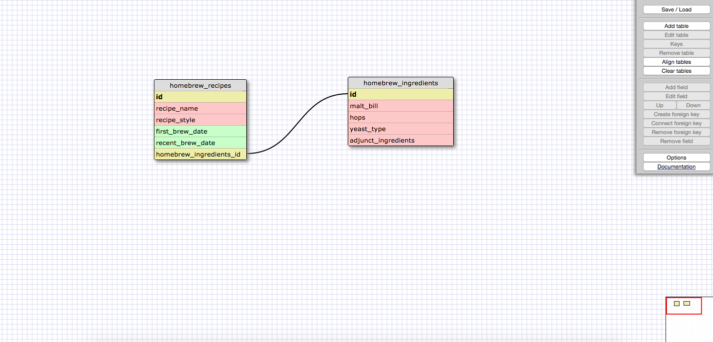
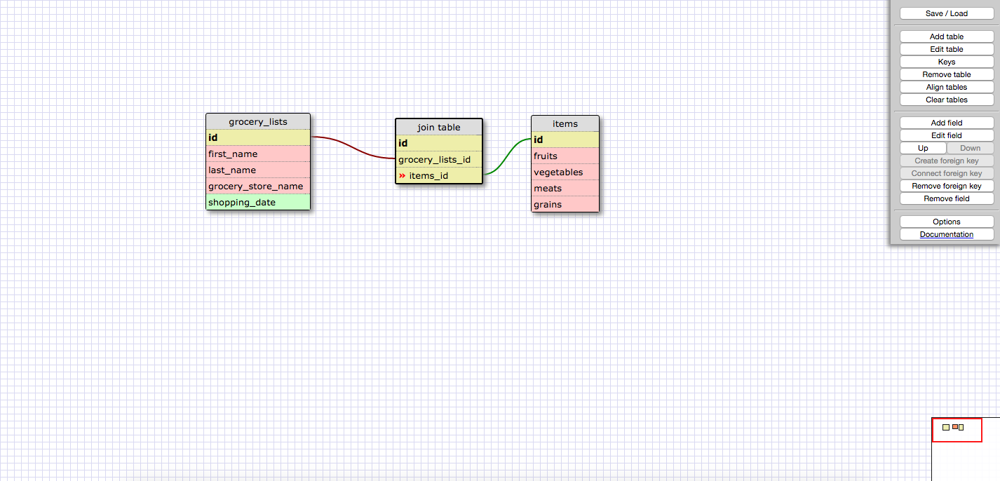

### One-to-One Relationship

I believe this is a one-to-one relationship because I used the two tables to essentially split up data that could have been a part of one table. For each recipe name/style in the homebrew recipes table, there is only one corresponding set of ingredients (malt bill, hops, yeast, etc.). I could have listed this all out in one table, but ingredients lists can get pretty lengthy, and maybe I just want to query the names of recipes I've made in the past, including the dates I first brewed them as well as most recently; I don't want all the ingredient information to bog down that query, so I put it in another table and use a one-to-one relationship to link those two tables.

### Many-to-Many Relationship

### Reflection

##### What is a one-to-one database?

A one-to-one database contains a relationship between two tables wherein each row of information from one table corresponds to exactly one rwo of information from another table. It's almost as if one table is an extension of the other, containing more information that could have been present in one table but was split up into two for various reasons.

##### When would you use a one-to-one database? (Think generally, not in terms of the example you created).

One might use a one-to-one database when storing a ton of information. All of that information may be necessary at some point or another, but most of the information may not be necessary on a day-to-day basis. A one-to-one database can help filter out the least used data into another table, keeping the main data free and uncluttered. All of the data will still be linked together one-to-one, but it will just be separate.

##### What is a many-to-many database?

A many-to-many database consists of three tables where data from one table can be applied to multiple data in another table, and vice versa. The third table helps to connect all of this data when running a query. In other words, Table A may have information that applies to multiple rows in Table B, and Table B may have information that applies to multiple rows in Table A, so we need to use a third table to help join up the ids for all of these rows so we can see how all of this data is interrelated.

##### When would you use a many-to-many database? (Think generally, not in terms of the example you created).

You would use this type of database to help simplify complex relationships amongst different sets of data. If you were to try to make a many-to-many database as one table, there would be a lot of repetition of information because that is inherent in this type of relationship. By separating this information out into multiple tables (usually two), we only need to identify data once and just use the id for this data to link between the two data sets.

##### What is confusing about database schemas? What makes sense?

The confusing thing is actually using these databases outside of the vaccuum of a DBC challenge. I understand the types of relationships and how SQL queries this data based on primary keys and foreign keys, but it's hard to put this all together to create a functioning database for something useful. I'm sure we'll get there soon, or at least I can try to read up on taking all of this specific information and applying it in a global sense to create something unique and useful, like I said above.